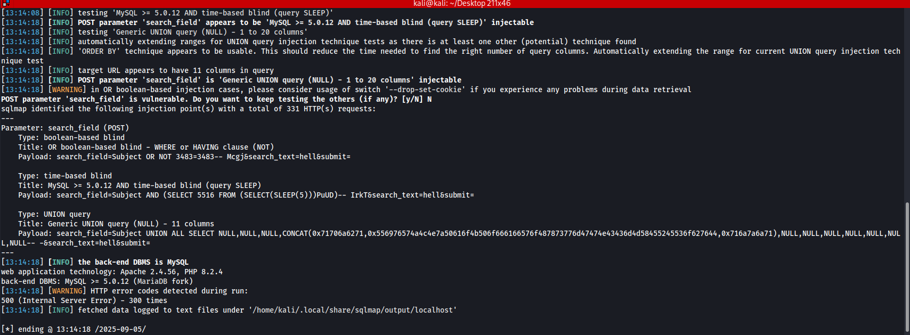
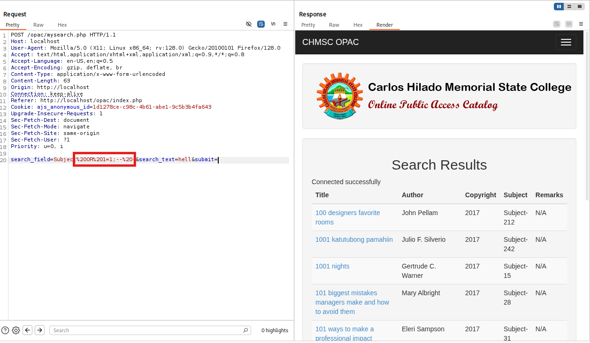
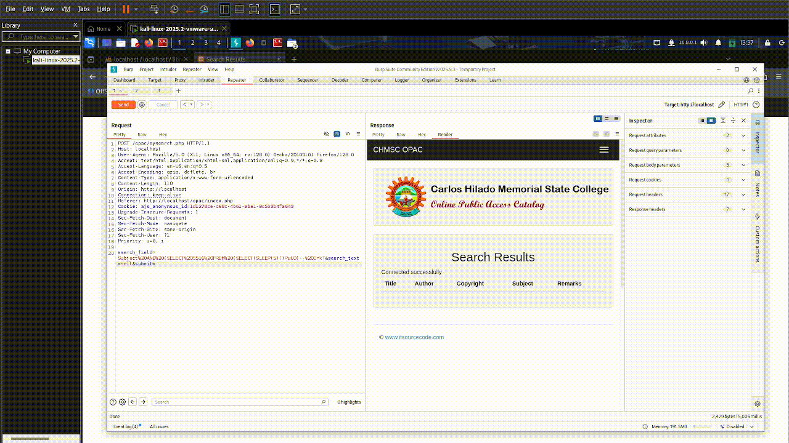
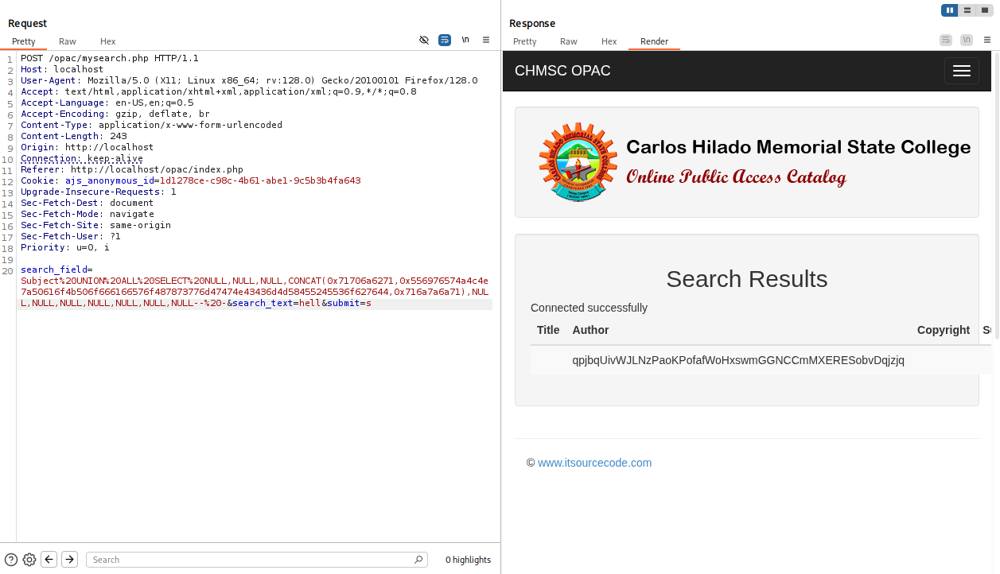

# Online-Public-Access-Catalog OPAC SQL Injection

**Vulnerability Type:** SQL Injection
</br>
**Affected File:** ``mysearch.php``
</br>
**Parameter:** ``search_field (POST)``
</br>
**Vendor:** [itsourcecode](https://itsourcecode.com/)
</br>
**Product:** [Online Public Access Catalog OPAC](https://itsourcecode.com/free-projects/php-project/online-public-access-catalog-opac-php-mysqli/)
</br>
**Database:** I fixed the ``library.db`` file because the vendor had a wrong configuration in the published file. [library.db](https://github.com/drew-byte/Online-Public-Access-Catalog-OPAC-SQLi-PoC/blob/main/library.db)

### Summary
-  The ``mysearch.php`` file of the application is vulnerable to multiple forms of SQL Injection due to unsanitized user input being concatenated directly into SQL statements. Attackers can manipulate the ``search_field`` and search_text POST parameters to inject malicious SQL. This allows for boolean-based blind, time-based blind, and UNION-based injection techniques, enabling database enumeration and data exfiltration.

### Vulnerable Code
```php
$sql = "SELECT * FROM BookDetails WHERE $strField LIKE '$strText'";
```

-  ``$strField`` comes from ``$_POST['search_field']`` and is not whitelisted.
-  ``$strText`` comes from ``$_POST['search_text']`` and is not parameterized.

**Evidence:** *sqlmap output*



---

### Proof of Concept
#### 1. Boolean-Based Blind Injection
-  Payload ``'OR 1=1;-- -`` forces the WHERE clause to always be true.
-  Application returns all records.



#### 2. Time-Based Blind Injection
-  The response is delayed by ``~5`` seconds, confirming execution of the injected SQL function.
-  Changing to ``SLEEP(10)`` produces a ``~10`` second delay.



#### 3. Union-Based Blind Injection
-  The injected UNION query inserts a marker string ``(UvWJLNzP...)`` into the result set.
-  Marker appears in the application response, confirming full UNION injection.



---

### Impact
-  **Confidentiality (C):** ``UNION`` injection lets an attacker read arbitrary tables, so database disclosure is possible.
-  **Integrity (I):** If the DB user has ``INSERT/UPDATE/DELETE`` rights (very common in apps), the attacker can modify or delete records.
-  **Availability (A):** Time-based injection with ``SLEEP(30)`` or ``BENCHMARK()`` can easily tie up DB threads and cause a denial of service.
